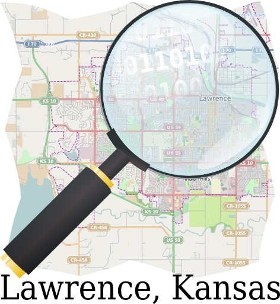

## [Free/Libre Open Source and Open Knowledge Association of Kansas](http://www.openkansas.us/)

[Events](/events-1)‎ > ‎[Past](/events-1/past)‎ > ‎

## Intro to Openstreetmap March 29 Lawrence Creates
(http://hackerspaces.org/wiki/Lawrence_Creates_Makerspace) we will be organizing a intro to (openstreetmap.org)

Location https://www.openstreetmap.org/node/2480338498
512 E 9th St. (9th and NJ), Lawrence, KS
66044-66044 Lawrence
United States of America

Event Links:
OSM KC : http://www.meetup.com/osm-kc/events/170896822/
Lawrence Creates: http://www.meetup.com/Lawrence-Creates-Makerspace/events/170897582/
Diary Entry : https://www.openstreetmap.org/user/James%20Michael%20DuPont/diary/21213
Couchsurfing : https://www.couchsurfing.org/n/events/intro-to-osm-openstreetmap-lawrence
Facebook : https://www.facebook.com/events/1471906629704317
Googleplus : https://plus.google.com/events/c50d3dqrtcjkq3s380pbe0opi2g
